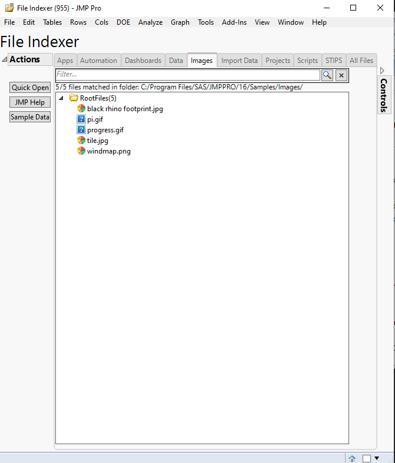

# Basic template

| [Description](#description) | [Usage](#usage) | [Execution](#execution) | [Possible future features](#possible-future-features) |

## Description 
TOOL IS STILL WORK IN PROGRESS

## Usage

Usage

### User-interface



### Options

| Option  | Purpose     | Values |
| ------- | ----------- | ------ |
| optiopn | description | value  |


## Execution

```javascript
code_example
```

## Possible future features
 * Add text